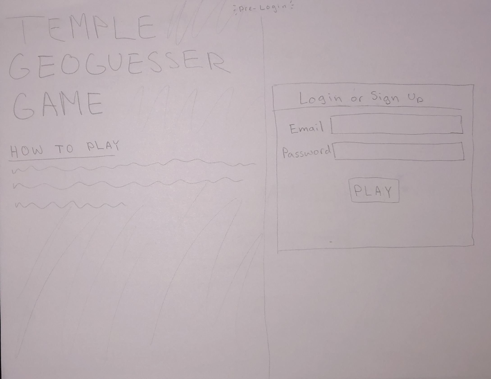
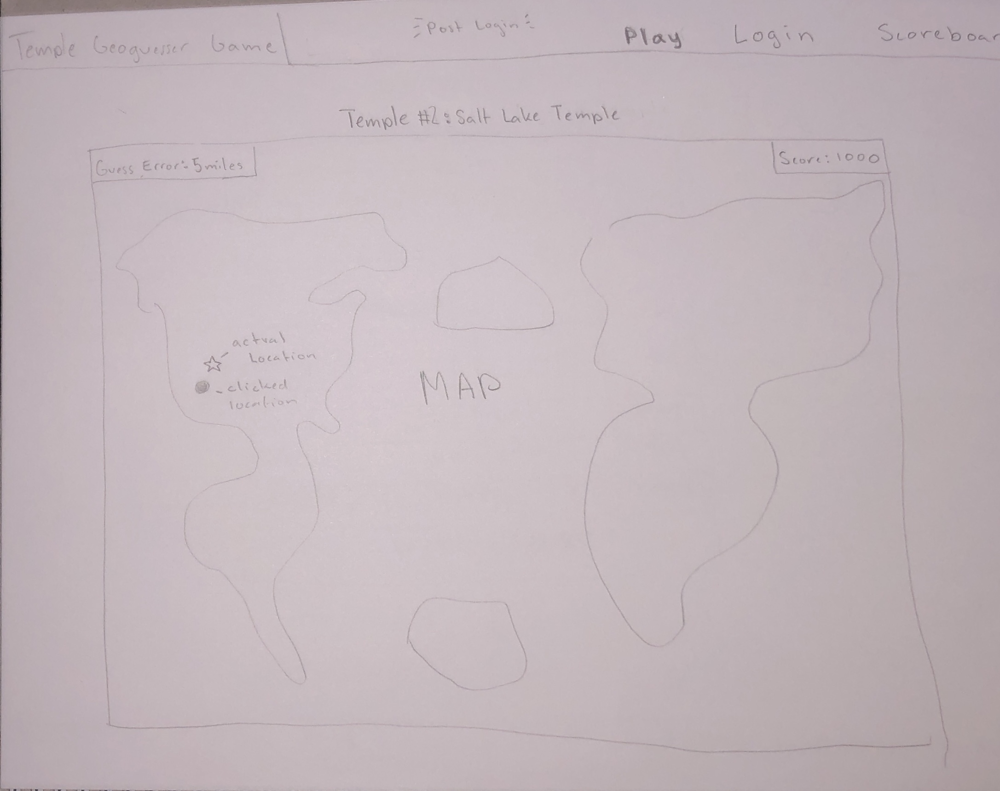
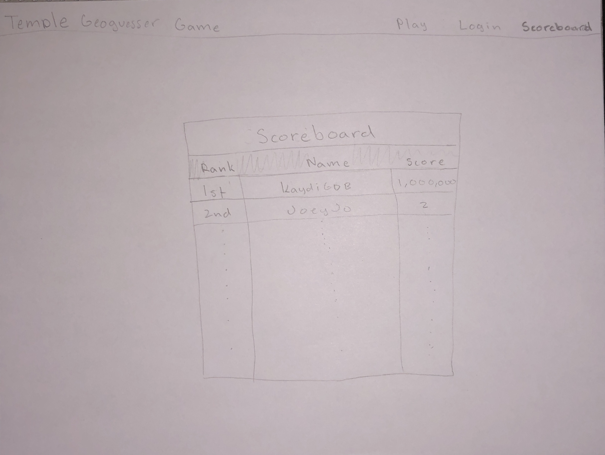

# Temple GeoGuesser Game 
## Elevator Pitch ##
This game is a fun way to test your geography skills. You will be given the name of an LDS temple and you will have to guess it's location on the map. The closer you are to the actual location, the more points you will earn. Have fun competing with your friends to see who can get the highest score.

## Key Features ##
- Secure login over HTTPS
- Gives 5 randomly picked temples to guess from
- Ability to click on the map to guess the location of the temple
- Shows the correct location of the temple after you have guessed
- Calculates the distance between your guess and the actual location
- Overall score that keeps track of how many points you have earned
- Scoreboard to keep track of high scores of all users

## Technologies ##
- **HTML**	- Uses correct HTML structure for application. Three pages: login, game, and scoreboard.
- **CSS**	- Application styling that looks good on different screen sizes, uses good whitespace, color choice and contrast. Has a map container, buttons, and text.
- **JavaScript** - Will create interactivity in the game. Provides way to click on the play button, handles clicks on the map, and calculates distance between two points.  
- **React** - Will be used to create the login, game and scoreboard components. Will use react-leaflet to render the map and place a marker for the current temple. 
- **Web service** - Will use a web service to get the temple data and to store the high scores. Will use public API to save scores. Enpoints for:
    - login
    - getting temple data
    - saving scores
    - getting high scores
- **Authentication** - Login in page where you can either create an account or login with an existing account. Name will be displayed on the scoreboard.
- **Database data** - Will store temple data and high scores in a database. Will have tables for:
    - users
    - temples
    - scores
- **WebSocket** - Will be used to update the scoreboard in real time.

## HTML Deliverable ##
- **HTML pages** - Three HTML pages that represent the ability to login, play, and look at scoreboard
- **Tags** - Correct use of BODY, NAV for navigation links, MAIN, HEADER, and FOOTER for github.
- **Links** - Navigation links at the top take you to the page you want to go to.
- **Text** - Text that tells you how to play. Also tells you your score.
- **3rd Party Service Calls** - Created image placeholder in play page for Google Maps Interactive API to go.
- **Images** - Temple image on home page and placeholder map image on play page.
- **Login** - Email and password input boxes to create and login.
- **Database** - Scoreboard stores rank, name, score, and number.
- **Websocket** - Messages on play page tell you who else is playing and what score they got. 

## CSS Deliverable ##
- **CSS header, footer, and main content body** - Header contains info to Bootstrap functionality and CSS. Footer is at the bottom with consistent styling and link to Github. Body contains navigation bar and main parts for each page.
- **Navigation Elements** - Used Bootstrap funtionality to create navigation bar on top. When it shrinks down, it will turn into an accordion that can be pressed to show elements. 
- **Window Resizing** - Used Bootstrap's "container-fluid" do make divs responsive to window resizing. Used CSS @media to determine limits for shrinking down.
- **Application Elements** - Used good contrast and whitespace.
- **Text Content** - Used consistent Bootstrap text fonts throughout. Headers and titles are properly sized to match importance.
- **Images** - Created picture box that holds temple picture and used CSS to make so it stays within the bounds of the left side of the screen. Also made so the bottom gets cut off when the screen becomes smaller.

## React Deliverable ##
- **Vite** - Bundled code with Vite and it can now be run with npm run dev.
- **React Components** - Created components for login, play, and scoreboard.
    - **Login** - Made button components for login and create. Used state to keep track of email and password.
    - **Play** - Implemented players component that makes a mock up of players getting updated in real time. Used state to keep track of score and temple data. Made map component that makes updates mock score and guess error. Will use actual coordinates once I can use google maps API.
    - **Scoreboard** - Made scoreboard component that makes a mock up of the scoreboard. Used state to keep track of scores.
- **React Router** - Used React Router to navigate between login, play, and scoreboard pages.
- **React Hooks** - Used useState to keep track of the temple index,temple number, total score, guess error, and if it's game over. Used useEffect to update temple data and scores. Also used useEffect to update the scoreboard in real time.

## Service Deliverable ##
- **Node.js and Express** - done!
- **Express static middleware** - done!
- **Calls to third-party endpoints** - Used fetch on a third-party api that gets the user's location from their ip address. I then calculated how far the user is from the temple. I couldn't figure out how to make the google maps api give me the right coordinates. However, I found a library called react-leaflet that I might used instead.
- **Backend provides service endpoints** - I created endpoints for login and scores that will be used in the frontend.
- **Frontend calls service endpoints** - I used fetch to call the login and scores endpoints in the frontend.

## Service Login Deliverable ##
- **Supports new user registration** - Done! Puts a new user in mongodb with their own authtoken and id.
- **Supports existing user authentication and logout** - Done! Checks if the user is in the database and if the password is correct. If it is, it will give the user an authtoken. If the user logs out, it will delete the authtoken.
- **Stores application data in MongoDB** - Done! Stores user data in mongodb. Stores temple data in mongodb. Stores scores in mongodb.
- **Stores and retrieves credentials in MongoDB** - Done! Stores user credentials in mongodb. Retrieves user credentials from mongodb.
- **Restricst application functionality based upon authentication** - Done! If the user is not logged in, they can't see the scoreboard or play. If the user is logged in, they can see the scoreboard and play.

## WebSocket Deliverable ##
- **Backend WebSocket server** - Done! 
- **Frontend WebSocket client** - Done!
- **Data sent over Wbsocket connection** - Done! Sends the user's name and score to the server. The server then sends the user's name and score to all the other users.
- **WebSocket data displayed in application** - Done! Displays the user's name and score on the play page.

## Design ##

